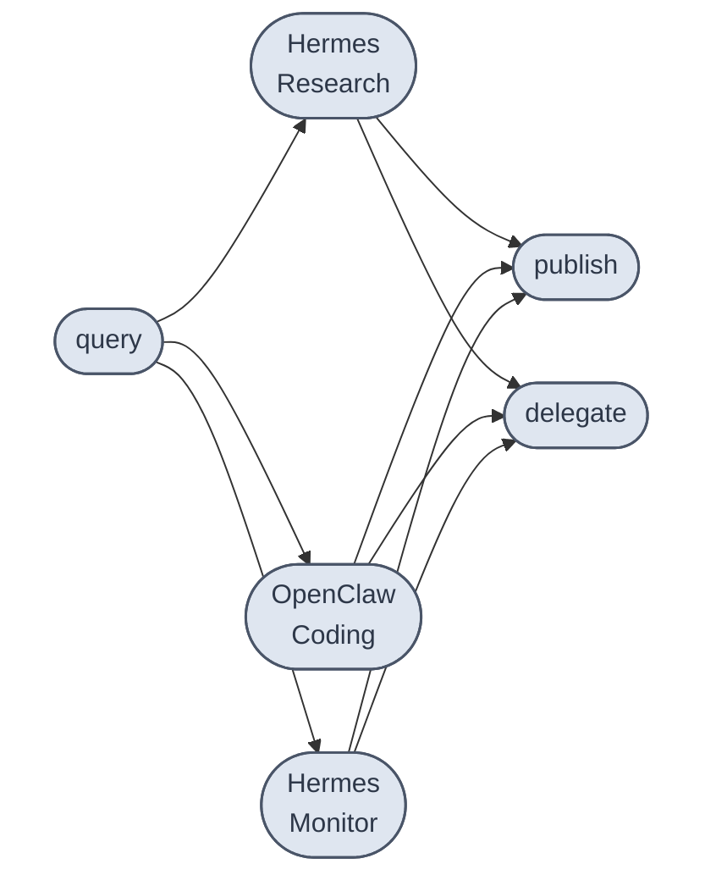
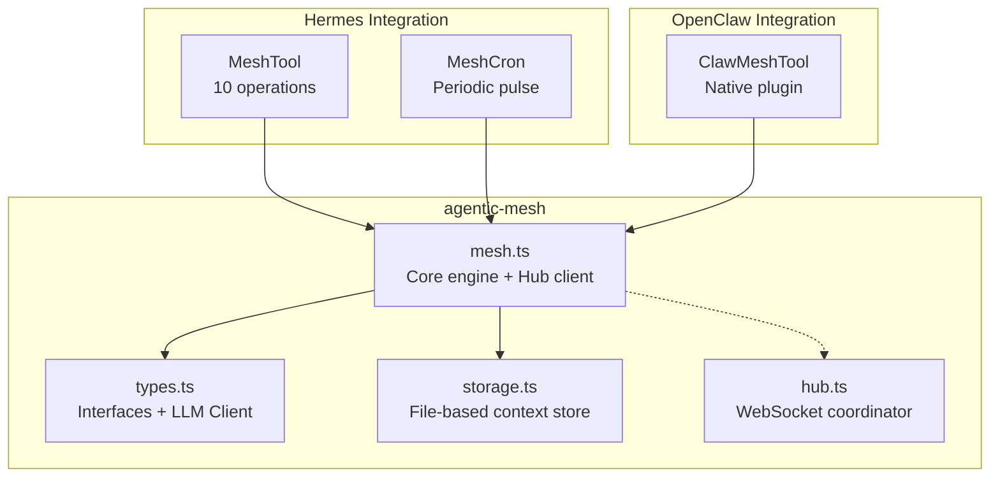
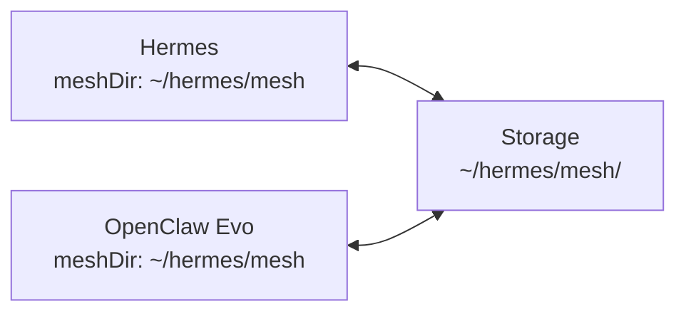
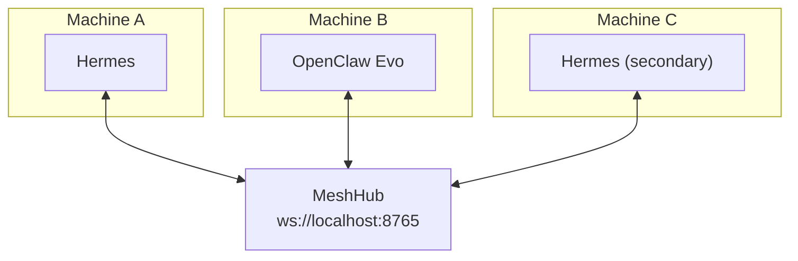
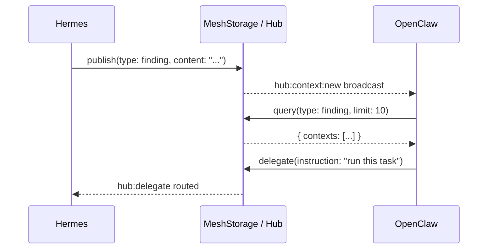

# agentic-mesh

<p align="center">

[](https://opensource.org/licenses/MIT)
[](https://www.typescriptlang.org/)
[](https://nodejs.org/)
[](https://www.npmjs.com/package/agentic-mesh)
[](https://bundlephobia.com/package/agentic-mesh)
[](https://github.com/DevvGwardo/agentic-mesh/pulls)

**Cross-agent collaboration framework for [Hermes](https://github.com/DevvGwardo/claude-code) and [OpenClaw](https://github.com/DevvGwardo/openclaw-evo) — shared context, peer discovery, and task delegation.**

</p>

---

## Why?

**You have multiple AI agents running at the same time — and they don't know what each other are doing.**

You might be running:
- A **coding agent** (OpenClaw) that is building your project
- A **research agent** (Hermes) that is investigating a library
- A **monitoring agent** (Hermes) that is watching logs or running tests

And right now, if the coding agent finds a bug, the research agent has no idea. If the monitoring agent discovers something important, the coding agent never sees it.

**`agentic-mesh` fixes that.**

It gives every agent a shared space to:
- **Publish** what they find, so other agents can see it
- **Query** what other agents have discovered
- **Delegate** tasks directly to a specific agent

No agent works in isolation anymore. They collaborate.



---

## What it does

- **Publish** findings, tasks, code snippets, notes, and logs to a shared context store
- **Query** what other agents have discovered or are working on
- **Delegate** tasks to specific agent runtimes (e.g. "run this search on OpenClaw")
- **Discover** peer agents automatically and monitor their status
- **Orchestrate** multi-agent workflows with structured coordination

Agents can run on the same machine or across different machines — the **Hub** WebSocket service bridges them.

---

## Architecture

### Core Components



### Operating Modes

**DIRECT Mode** — Agents share a filesystem directory. Zero infrastructure, same-machine only.



**HUB Mode** — Agents connect via WebSocket. Works across machines.



---

## Context Flow



---

## Quick Start

### Installation

```bash
npm install agentic-mesh
```

### 1 — Start the Hub (optional)

Required only for cross-machine deployments.

```bash
PORT=8765 MESH_DIR=./mesh-store npx ts-node/esm src/hub.ts
```

### 2 — Initialize in your agent

**Hermes** — add to your profile init script:

```typescript
import { Mesh } from 'agentic-mesh';

const mesh = await Mesh.create({
  meshId: 'clawborators',
  meshDir: '~/.hermes/mesh',           // DIRECT mode
  // hubUrl: 'ws://localhost:8765',       // HUB mode
  agentInfo: {
    id: 'hermes-main',
    name: 'Hermes',
    runtime: 'hermes',
    version: '1.x.x',
    capabilities: {
      canReadContext: true,
      canWriteContext: true,
      canOrchestrate: true,
      canDelegate: true,
      maxContextBytes: 100_000,
    },
  },
});

// Publish a finding
await mesh.publish({
  type: 'finding',
  content: 'The OAuth flow has a race condition in token refresh.',
  tags: ['bug', 'auth'],
  importance: 3,
});

// Query what's happening
const qr = await mesh.query({ tags: ['bug'], limit: 10 });
const { contexts } = qr.data;

// Add mesh context to your system prompt
const meshContext = await mesh.buildMeshContext();
```

**OpenClaw** — configure as a plugin:

```yaml
# ~/.openclaw/config.yaml
plugins:
  agentic-mesh:
    meshId: clawborators
    meshDir: ~/.openclaw/mesh
    hubUrl: ws://localhost:8765  # optional
```

Then call the `mesh` tool:

```yaml
tool: mesh
args:
  operation: publish
  type: finding
  content: "Found a memory leak in the session manager..."
  tags: [memory, leak]
  importance: 3
```

---

## Mesh Tool Operations

The `mesh` tool exposes 10 operations:

| Operation | Description |
|-----------|-------------|
| `publish` | Share context with the mesh |
| `query` | Search shared context by type, tags, agent, text |
| `read` | Get a specific context by ID |
| `update` | Edit content, tags, or TTL of an existing context |
| `delete` | Remove a context |
| `agents` | List active peers and their status |
| `delegate` | Assign a task to another agent |
| `ping` | Check mesh connectivity and stats |
| `summarize` | Human-readable digest of recent activity |
| `context` | Mesh data formatted for a system prompt |

### publish

```typescript
await mesh.publish({
  type: 'finding',       // task | finding | code | log | note | plan | result | message | system
  content: '...',
  tags: ['research'],
  importance: 2,          // 1=low, 2=medium, 3=high
  ttlSeconds: 3600,       // auto-expire after 1h (0=forever)
});
```

### query

```typescript
const qr = await mesh.query({
  type: 'finding',
  agentName: 'OpenClaw Evo',
  tags: ['bug', 'research'],
  search: 'race condition',
  limit: 20,
});
// qr.data.contexts, qr.data.total, qr.data.hasMore
```

### delegate

```typescript
const { taskId, assignedTo } = await mesh.delegate(
  'Search the codebase for memory leaks in session manager',
  2  // priority: 1=high, 2=medium, 3=low
);
```

### agents

```typescript
const { agents } = await mesh.listPeers();
// → [{ id, name, runtime, status, capabilities, ... }, ...]
```

---

## Context Types

| Type | When to use |
|------|-------------|
| `task` | A goal or work item |
| `finding` | Research result, discovered fact |
| `code` | Code snippet or artifact |
| `log` | Structured event or log entry |
| `note` | Free-form note |
| `plan` | Multi-step plan |
| `result` | Final output or deliverable |
| `message` | Direct message to another agent |
| `system` | Heartbeat, status update |

---

## Storage Format

```
{meshDir}/
  agents.json           ← registered agent list
  contexts/
    {uuid}.json         ← individual context documents
  delegation/
    {uuid}.json         ← pending delegation tasks
```

Sample context file:

```json
{
  "id": "abc-123",
  "meshId": "clawborators",
  "agentId": "hermes-main",
  "agentName": "Hermes",
  "runtime": "hermes",
  "type": "finding",
  "content": "The OAuth flow has a race condition...",
  "tags": ["bug", "auth"],
  "importance": 3,
  "ttlSeconds": 3600,
  "createdAt": 1743612000000,
  "updatedAt": 1743612000000,
  "expiresAt": 1743615600000
}
```

---

## Hermes Integration

### MeshTool

The `mesh` tool is available to the Hermes agent as a native tool:

```
tool: mesh
args:
  operation: query
  filter_type: finding
  filter_search: race condition
  limit: 5
```

### MeshCron

Schedule a periodic mesh pulse via Hermes cron:

```bash
/cron add "mesh-pulse" --every 15m --skill mesh_cron
```

MeshCron publishes a heartbeat, queries recent activity, and returns a digest.

---

## OpenClaw Integration

Register the plugin in your OpenClaw config:

```yaml
# ~/.openclaw/config.yaml
plugins:
  agentic-mesh:
    meshId: clawborators
    meshDir: ~/.openclaw/mesh
    hubUrl: ws://localhost:8765  # optional
```

The `mesh` tool is available alongside OpenClaw's native tools with all 10 operations.

---

## Hub Protocol

The Hub speaks JSON over WebSocket. Message types:

### Agent → Hub

| Message | Payload |
|---------|---------|
| `hub:join` | `{ meshId, info: AgentInfo }` |
| `hub:leave` | `{ meshId }` |
| `hub:context:new` | `{ context: MeshContext }` |
| `hub:context:del` | `{ id }` |
| `mesh:op` | `MeshOp` |
| `agent:status` | `{ status }` |

### Hub → Agent

| Message | Payload |
|---------|---------|
| `hub:ping` | `{ agents: AgentInfo[] }` |
| `hub:context:new` | `{ context: MeshContext }` |
| `hub:context:del` | `{ id }` |
| `hub:delegate` | `DelegationTask` |
| `hub:delegate:result` | `{ taskId, result }` |
| `mesh:result` | `MeshResult` |

---

## API Reference

### Mesh.create(config) → Promise&lt;Mesh&gt;

Create and initialize a mesh instance.

```typescript
const mesh = await Mesh.create({
  meshId: string,              // logical group (e.g. 'clawborators')
  agentInfo: AgentInfo,        // this agent's identity + capabilities
  meshDir?: string,            // file storage path (omit for Hub-only)
  hubUrl?: string,             // WebSocket Hub URL (optional)
  wsImpl?: typeof WebSocket,   // injectable for testing
  llm?: LLMClient,             // for context summarization
  heartbeatMs?: number,         // Hub ping interval (default: 30s)
  staleMaxAgeMs?: number,       // purge threshold (default: 24h)
});
```

### mesh.publish(params) → Promise&lt;MeshResult&gt;

Publish context to the mesh.

### mesh.query(filter) → Promise&lt;MeshQueryResult&gt;

Search mesh context.

### mesh.listPeers() → Promise&lt;MeshAgentsResult&gt;

List active peer agents.

### mesh.delegate(instruction, priority) → Promise&lt;MeshDelegationResult&gt;

Delegate a task to a peer agent.

### mesh.buildMeshContext() → Promise&lt;string&gt;

Format recent mesh activity as a string for injection into a system prompt.

### mesh.summarizeActivity(hours?) → Promise&lt;string&gt;

Human-readable digest of mesh activity over a time window.

---

## Comparison with agentic-primitives

| Feature | [agentic-primitives](https://github.com/DevvGwardo/agentic-primitives) | agentic-mesh |
|---------|---------|---------|
| Focus | Single-agent patterns | **Multi-agent collaboration** |
| Storage | Ephemeral | Persistent filesystem |
| Cross-agent context | No | **Yes** |
| Task delegation | Via Coordinator (LLM only) | **Direct to peer agents** |
| Peer discovery | No | **Yes** |
| Hub (cross-machine) | No | **Yes (optional)** |
| Hermes support | Via cron only | **Tool + cron** |
| OpenClaw support | Indirect | **Native tool plugin** |

`agentic-mesh` and `agentic-primitives` are complementary. Use `coordinator` from agentic-primitives for structured LLM-driven orchestration within a mesh context.

---

## License

MIT © DevvGwardo
